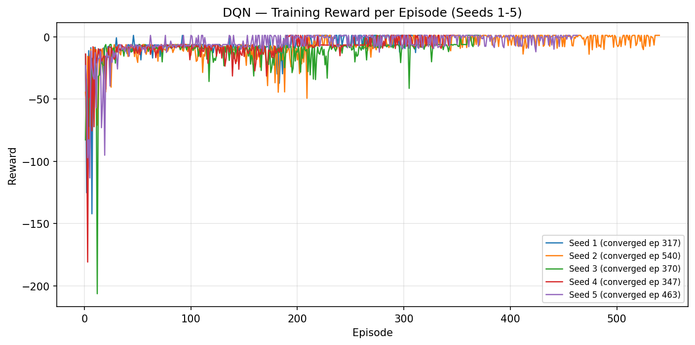
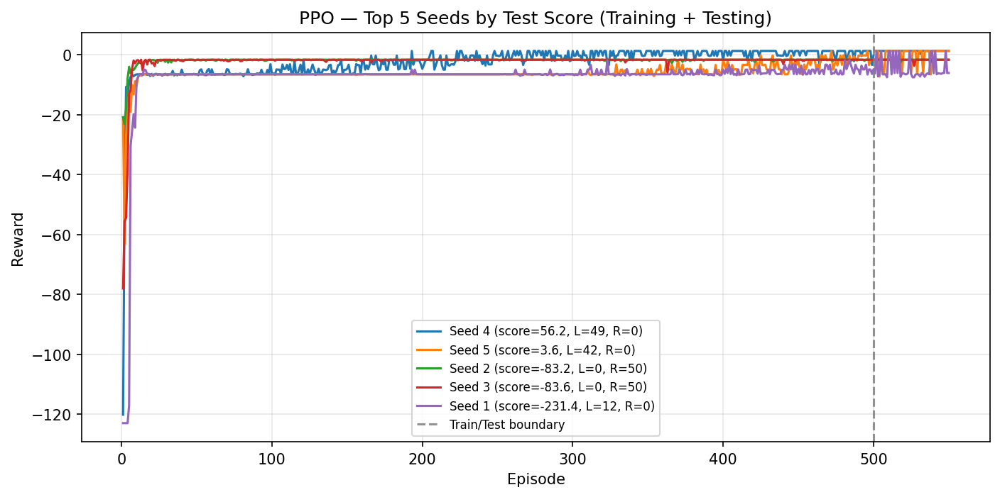

# Reinforcement Learning: DQN and PPO on a Custom FrozenLake

From-scratch implementations of Deep Q-Network (DQN) and Proximal Policy Optimization (PPO) in TensorFlow/Keras on a custom Gym-based FrozenLake environment. Developed for the *Introduction to Deep Reinforcement Learning* course at the Technical University of Munich, building on the course template.

**Highlights**
- Dueling Double DQN with Prioritized Experience Replay, implemented with a custom SumTree
- PPO with GAE, entropy regularization and parallel actors
- DQN converged in 5/5 seed runs using the tuned configuration; PPO reached the optimal goal in ≥90% of test episodes for 3/5 seeds

## Environment

`environment.py` (provided by the course and unmodified) defines a custom FrozenLake:

- Seven state variables: two for the agent's position, five influencing state-dependent rewards
- Four deterministic actions: up, down, left, right
- Three positive terminal states (treasures) and multiple negative terminal states (lake breakpoints)
- Non-uniform, path-dependent rewards that make exploration and credit assignment hard

## Implementation

**DQN** (`DQN - Annotated Code.py`): Double DQN targets, dueling architecture, Prioritized Experience Replay (custom SumTree, stratified sampling, importance-sampling weights, priorities from absolute TD errors), separate online and target networks, Huber loss, gradient clipping, epsilon-greedy exploration with decay.

**PPO** (`PPO - Annotated Code.py`): separate actor and critic networks (two hidden layers, 64 units, ReLU), GAE-λ with normalized advantages, clipped surrogate objective, entropy bonus, mini-batch updates over multiple epochs, bootstrapped values for truncated episodes, parallel rollouts.

## Results

**DQN.** 12 hyperparameter configurations (ε decay, ε_min, γ) were screened on seeds 0–9 over 1000 episodes. Lower γ and higher ε_min performed best, so lower γ values (down to 0.75) were added. The seven best configurations were then tested on seeds 0–50. Three of them (ε_min = 0.1; decay 0.98/γ = 0.8, decay 0.99/γ = 0.75, decay 0.98/γ = 0.85) converged in 90–95% of runs, and stayed consistently high on seeds 1–100. Huber loss was chosen over MSE because it limits the influence of large TD-error outliers, which matters with Prioritized Experience Replay. A reproducibility run with the best configuration (γ=0.85, ε_min=0.1, decay=0.98) converged in all 5 tested seeds, with early stopping between episodes 400–470.



**PPO.** The clipped objective with GAE was robust to hyperparameter changes. Instability (value-loss explosion, premature policy collapse) was resolved by an entropy bonus and gradient clipping on the critic. Across 5 test seeds (50 episodes each), 3 seeds reached the optimal goal in more than 45/50 episodes, 1 seed in 20–45, and 1 seed in fewer than 20.



**What did not help.** Reward shaping (Manhattan-distance penalty, both methods) and Bayesian optimization with Optuna (PPO; multiple days of compute, worse scores) were tested and dropped.

## How to run the code

```bash
python3 -m venv venv
source venv/bin/activate        # Windows: venv\Scripts\activate
pip install -r requirements.txt
python "DQN - Annotated Code.py"
python "PPO - Annotated Code.py"
```

## Files

| File | Description |
|---|---|
| `environment.py` | Custom Gym FrozenLake environment (course-provided) |
| `DQN - Annotated Code.py` | Dueling Double DQN with Prioritized Experience Replay |
| `PPO - Annotated Code.py` | PPO with GAE, entropy regularization and parallel rollouts |
