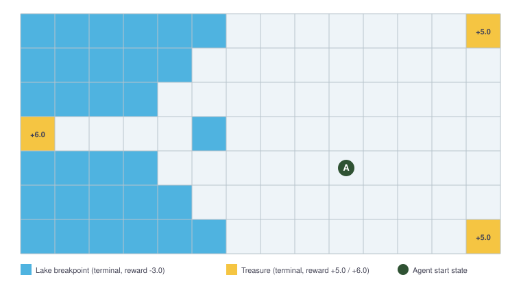

# Reinforcement Learning: DQN and PPO on Custom FrozenLake

This repository contains from-scratch implementations of Deep Q-Network (DQN) and Proximal Policy Optimization (PPO) for a custom Gym-based FrozenLake environment. The project was developed as part of the *Introduction to Deep Reinforcement Learning* course at the Technical University of Munich.

The objective is to learn an optimal path to a treasure while avoiding terminal failure states under a non-uniform, path-dependent reward structure. The project focuses on implementing and comparing value-based and policy-gradient reinforcement learning methods rather than relying on pre-built RL libraries.

## Environment

The custom FrozenLake environment contains:

- **Seven state variables**: two representing the agent's position, five influencing state-dependent rewards
- **Four deterministic actions**: up, down, left, and right
- **Three positive terminal states** representing treasures
- **Multiple negative terminal states** representing lake breakpoints
- A **non-uniform reward structure** that creates challenges for exploration and temporal credit assignment

## Technical Implementation

### Deep Q-Network

The DQN implementation extends a standard value-based agent with several techniques designed to improve learning stability and sample efficiency:

- Double DQN targets to reduce Q-value overestimation
- Dueling network architecture with separate value and advantage streams
- Prioritized Experience Replay, implemented using a custom SumTree data structure
- Stratified priority-based sampling with importance-sampling weights
- Priority updates based on absolute temporal-difference errors
- Separate online and target networks with periodic synchronization
- Huber loss for robust temporal-difference learning
- Global gradient clipping
- Epsilon-greedy exploration with controlled decay

### Proximal Policy Optimization

The PPO implementation uses a separate actor–critic architecture and an on-policy training pipeline:

- Separate multilayer perceptrons for the policy and value functions
- Generalized Advantage Estimation (GAE-λ) for lower-variance advantage estimates
- Normalized advantages
- PPO's clipped surrogate objective
- Entropy regularization to encourage exploration
- Mini-batch optimization over collected trajectories
- Bootstrapped value estimates for truncated episodes
- Multiple parallel actors for experience collection
- Independent optimization of the actor and critic networks

## Evaluation

Both agents are evaluated using:

- Average episodic reward
- Success rate
- Convergence speed
- Training stability
- Sensitivity to hyperparameters and architecture choices

The comparison highlights the different behavior of an off-policy, value-based method with replay memory and an on-policy actor–critic method operating directly on collected trajectories.

## Repository Structure

| File | Description |
|---|---|
| `DQN - Annotated Code.py` | Dueling Double DQN with Prioritized Experience Replay |
| `PPO - Annotated Code.py` | PPO with GAE, entropy regularization, and parallel experience collection |
